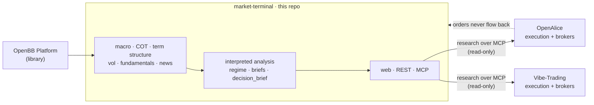

# market-terminal

> Private, single-user **multi-asset research terminal** — the research brain that
> AI execution agents pull from over MCP. Research only; orders never flow back in.

[](https://github.com/jalilsedna/market-terminal/actions/workflows/ci.yml)
[](https://www.python.org/)
[](https://fastapi.tiangolo.com/)
[](https://openbb.co)
[](https://modelcontextprotocol.io/)
[](https://docs.astral.sh/ruff/)
[](#)

A **multi-asset research terminal** built on [OpenBB](https://openbb.co)
(consumed as a library — never forked): macro, market data, positioning (COT),
term structure, sector rotation, news, plus an **interpreted analysis layer**
(positioning extremes, risk-on/off regime, per-instrument briefs). It ships a
web dashboard, a REST API, and an **MCP server** so an AI agent can pull the
research directly.

**Research and analytics only — execution is delegated, not duplicated.** No
order entry, position management, or broker connectivity lives here; no
trade/transfer/withdrawal keys ever do. Execution belongs to *separate* apps
([OpenAlice](https://github.com/TraderAlice/OpenAlice),
[Vibe-Trading](https://github.com/HKUDS/Vibe-Trading)) that **pull** research
over MCP and decide/execute on their own side. Research flows out; orders never
flow back in. See [`docs/openalice.md`](./docs/openalice.md).



- **Stack:** Python 3.12 · FastAPI · OpenBB Platform · MCP
- **Deploys to:** Railway, as one authenticated service (web + REST + MCP). See
  [`docs/deploy-railway.md`](./docs/deploy-railway.md) to deploy and
  [`docs/operator-guide.md`](./docs/operator-guide.md) for day-2 ops (data,
  backups, users, token rotation).
- **Spec / rules:** [`SPEC.md`](./SPEC.md) · [`CLAUDE.md`](./CLAUDE.md) ·
  backlog in [`ROADMAP.md`](./ROADMAP.md)

## Project layout

```
app/         FastAPI app, routers, schemas, auth, pre-cache
services/    thin domain logic per view (incl. services/analysis.py)
obb_layer/   the ONLY place that imports openbb
cache/       response cache (per-data-type TTLs)
web/         single-page dashboard (vanilla JS) + login page
tests/       pytest suite (auth, config, MCP mount) — CI-gated
docs/        deploy + OpenAlice integration guides
mcp_server.py  exposes the views as MCP tools (stdio or HTTP)
config.py    loads keys/settings from .env
```

## Setup & run (local)

Requires Python 3.12. On Windows use the `py -3.12` launcher; on macOS/Linux use
`python3.12`.

```bash
git clone https://github.com/jalilsedna/market-terminal.git
cd market-terminal

python3.12 -m venv .venv
source .venv/bin/activate           # Windows: .\.venv\Scripts\Activate.ps1

pip install --upgrade pip
pip install -r requirements.txt

cp .env.example .env                 # the app boots with NO keys (free providers)
uvicorn app.main:app
```

> **Auto-reload note.** Use plain `uvicorn app.main:app` for normal use. Do **not**
> point `--reload` at the whole folder: OpenBB rebuilds its static package inside
> `.venv/` the first time the installed extension set changes, and the default
> reloader watches `.venv/`, so it would reload mid-rebuild in a loop. For dev
> auto-reload, scope it to our source:
> ```bash
> uvicorn app.main:app --reload --reload-dir app --reload-dir services --reload-dir obb_layer
> ```

The app is then at <http://127.0.0.1:8000> — the dashboard at `/`, interactive
API docs at `/docs`, and a liveness check at `/health` (reports which providers
have keys and whether auth is enabled).

Run the Phase-0 capability probe (re-run after any OpenBB bump — see `SPEC.md`):

```bash
python -m obb_layer.probe
```

## Authentication

Locally with no credentials set, the terminal is **open** (keyless dev). It
becomes **gated** the moment you set credentials — required on any public
deploy:

- `AUTH_TOKEN` — Bearer token for programmatic clients (the MCP feed / API).
- `ADMIN_USERNAME` + `ADMIN_PASSWORD` — the browser `/login` page.
- `SESSION_SECRET` — signs the session cookie (keep stable across restarts).

The browser gets a session cookie; agents/scripts send `Authorization: Bearer
<token>`. `/health` stays open and reports `auth_enabled`. See `app/auth.py` and
[`docs/deploy-railway.md`](./docs/deploy-railway.md).

## MCP server (query the views from an AI client)

`mcp_server.py` exposes the composed views as **Model Context Protocol** tools so
an AI client can pull your research directly.

```bash
python mcp_server.py          # stdio (Claude Desktop / Claude Code spawn it)
python mcp_server.py --http   # streamable-HTTP at http://127.0.0.1:8001/mcp
```

When the app is deployed, the same feed is mounted at `https://<app>/mcp` behind
the Bearer gate — no separate process needed.

**Claude Code** — from the project folder:

```bash
claude mcp add market-terminal -- .venv/bin/python mcp_server.py
```

**31 tools** (canonical list in `mcp_server.py`), all research context — never
trade triggers:

| Group | Tools |
|-------|--------|
| Macro / watchlist | `macro_dashboard`, `watchlist_summary` |
| Registry | `instruments_list`, `instruments_add`, `instruments_remove`, `instruments_search` |
| Futures / macro reads | `cot_positioning`, `cot_search`, `term_structure`, `sector_rotation`, `market_movers`, `market_news` |
| Analysis | `analysis_cot`, `analysis_regime`, `analysis_brief`, `analysis_term_structure` |
| Vol / alerts / TV | `volatility`, `alerts_status`, `tradingview_signals` |
| Stock brain (FMP) | `fundamentals`, `brain_verdict`, `brain_screen` |
| Crypto / FX brain | `crypto_brain_verdict`, `crypto_brain_screen`, `forex_brain_verdict`, `forex_brain_screen` |
| Signals | `trade_setup`, `daily_hitlist`, `market_setup`, `market_screen` |
| Alice centerpiece | **`decision_brief`** — one-call package (conviction + setup + vol + news + macro) |

See [`docs/fmp.md`](./docs/fmp.md) for the fundamentals brain and
[`docs/tradingview.md`](./docs/tradingview.md) for webhook signals.

**Feeding execution agents:** market-terminal stays research-only and acts as an
MCP data source agents *pull from* (multiple can share it). Start with
**`decision_brief(symbol)`**. **OpenAlice** — [`docs/openalice.md`](./docs/openalice.md),
[`docs/openalice-workflow.md`](./docs/openalice-workflow.md) (validated paper loop),
[`docs/openalice-wsl-setup.md`](./docs/openalice-wsl-setup.md),
[`docs/openalice-cursor-fallback.md`](./docs/openalice-cursor-fallback.md),
[`docs/openalice-cloud-deploy.md`](./docs/openalice-cloud-deploy.md) (A9). **Second
bot** — [`docs/vibe-trading.md`](./docs/vibe-trading.md) (Vibe-Trading, separate
Alpaca paper account; A11).

## Tests

```bash
pip install -r requirements-dev.txt
ruff check .
pytest
```

CI (`.github/workflows/ci.yml`) runs the same lint + tests on every push/PR, plus
an import-smoke job that installs the full OpenBB stack and imports every view —
so an OpenBB bump can't silently break a panel.

## Secrets

All keys live in `.env`, which is **gitignored and never committed** (only
read-only data-provider keys belong here). **FMP** is the primary market-data key
(`FMP_API_KEY`). Free macro/COT (FRED, CFTC) need no key. Add Tiingo/Polygon/
Benzinga keys only when you want extra resilience or features. Do not depend on OpenBB Hub. On Railway, the same variables are
set in the service's environment, never in the repo.

## Documentation

| Doc | Purpose |
|-----|---------|
| [`SPEC.md`](./SPEC.md) | Product specification & non-goals |
| [`CLAUDE.md`](./CLAUDE.md) | Engineering rules & conventions (canonical) |
| [`ROADMAP.md`](./ROADMAP.md) | Backlog + shipped ledger |
| [`docs/handoff.md`](./docs/handoff.md) | Live-state summary (read first for a new session) |
| [`docs/openalice.md`](./docs/openalice.md) | Execution-agent integration boundary |
| [`docs/openalice-cloud-deploy.md`](./docs/openalice-cloud-deploy.md) | 24/7 cloud (Railway) deploy recipe |
| [`docs/openalice-multi-broker.md`](./docs/openalice-multi-broker.md) | Brokers / UTAs / symbol map |
| [`docs/vibe-trading.md`](./docs/vibe-trading.md) | Second execution bot integration |
| [`docs/operator-guide.md`](./docs/operator-guide.md) | Day-2 ops (data, backups, tokens) |

## License

**Private & proprietary — all rights reserved.** This is a single-user research
project, not an open-source release; it is not licensed for redistribution or
reuse. [OpenBB](https://openbb.co) and other dependencies are consumed under their
own licenses (OpenBB is **not** forked — it is installed as a library).
