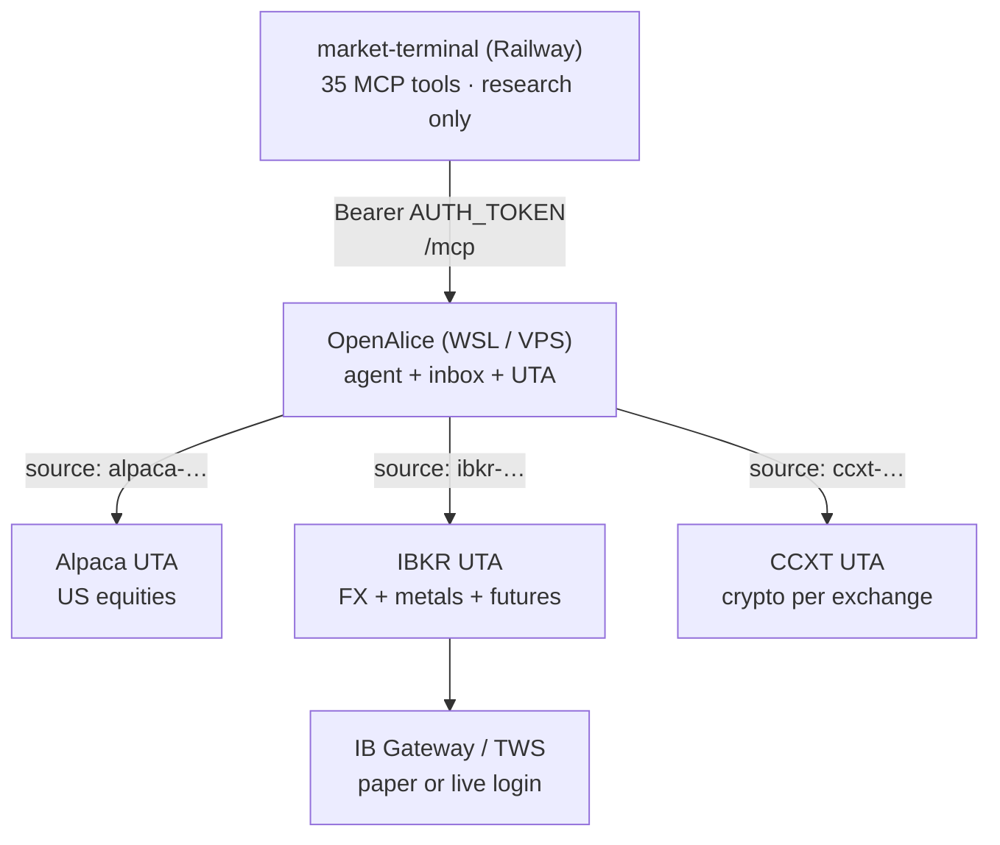

# OpenAlice — multi-broker execution (forex, metals, equities)

**ROADMAP A10.** market-terminal is **research-only** (Railway, MCP). **Execution**
lives in OpenAlice on your machine (or A9 VPS). Alpaca paper covers **US stocks +
limited crypto** — not spot forex or COMEX metals. This doc maps **which brokers
OpenAlice supports**, how to run **multiple UTAs** side by side, and how to wire
the research → execution loop for a **forex + metals** book.

See also: [`openalice.md`](openalice.md), [`openalice-workflow.md`](openalice-workflow.md),
[`openalice-cloud-deploy.md`](openalice-cloud-deploy.md), [`openalice-wsl-setup.md`](openalice-wsl-setup.md).

---

## The problem

| Your focus | Alpaca paper | market-terminal research |
|------------|--------------|--------------------------|
| US equities / ETFs | ✅ execute | ✅ `trade_setup`, `brain_*`, `decision_brief` |
| Crypto (BTC, ETH, …) | ⚠️ limited pair set | ✅ `market_setup`, `crypto_brain_*` |
| **Spot forex** (EURUSD, USDJPY, …) | ❌ not supported | ✅ `market_setup`, `forex_brain_*`, `decision_brief` |
| **Metals** (gold, silver) | ❌ not supported | ✅ GC COT, macro; execute via broker |

Research and execution must use **different UTAs** when asset classes differ.
One `getPortfolio` call without `source` often fails or returns the wrong account
when several brokers are configured.

---

## Architecture



**Rules (unchanged):**

- Broker / trade keys **never** go in market-terminal or Railway.
- Alice calls `getPortfolio` / `placeOrder` on the **correct `source`** for the asset.
- market-terminal `decision_brief` is still the one-call research read; route
  execution to the UTA that actually supports the symbol.

---

## Broker options in OpenAlice

Sources (checked **June 2026**, OpenAlice `v0.42.0-beta.1` upstream):

- [`packages/uta-protocol/src/brokers/preset-catalog.ts`](https://github.com/TraderAlice/OpenAlice/blob/master/packages/uta-protocol/src/brokers/preset-catalog.ts) — **user-facing presets** (Trading wizard)
- [`services/uta/src/domain/trading/brokers/registry.ts`](https://github.com/TraderAlice/OpenAlice/blob/master/services/uta/src/domain/trading/brokers/registry.ts) — **engine implementations** (`BROKER_ENGINE_REGISTRY`)
- [CCXT exchange list](https://github.com/ccxt/ccxt) — crypto venues behind the `ccxt` engine

OpenAlice uses a **preset → engine** model: you pick a named preset in the UI; it
maps to one of six engines. Each account becomes a UTA with id `{presetId}-{hash}`
(e.g. `alpaca-1c173aa4`, `ibkr-tws-a1b2c3d4`, `okx-…`).

### Six broker engines (implementation layer)

| Engine | Implementation | Asset classes |
|--------|----------------|---------------|
| **`ibkr`** | `IbkrBroker` — TWS/IB Gateway socket | **Forex (IDEALPRO)**, **spot metals** (XAU.USD, XAG.USD), **futures** (GC, SI), stocks, options, bonds |
| **`alpaca`** | `AlpacaBroker` — REST | US equities, ETFs; limited crypto |
| **`ccxt`** | `CcxtBroker` — unified CEX API | **Crypto** on 100+ exchanges (not spot FX) |
| **`longbridge`** | `LongbridgeBroker` — Longbridge OpenAPI | HK, US, CN A-shares (Stock Connect), SG **equities** (not forex) |
| **`leverup`** | `LeverupBroker` — Monad perp DEX (EIP-712 + Pyth) | Synthetic **crypto perps** (some forex-like symbols; on-chain, not IDEALPRO) |
| **`mock`** | `MockBroker` — in-memory | Dev / UI testing only |

### User-facing presets (Trading → Add account wizard)

These are the presets in `BROKER_PRESET_CATALOG` today:

#### Recommended

| Preset id | Label | Engine | Paper / demo | Auth | Notes |
|-----------|-------|--------|--------------|------|-------|
| **`ibkr-tws`** | IBKR (TWS / IB Gateway) | `ibkr` | Ports **7497** / **4002** = paper | TWS/Gateway login — **no API key** | **Your forex + metals path** |
| **`alpaca`** | Alpaca (US Equities) | `alpaca` | Paper / Live modes | API key + secret | US stocks only |
| **`longbridge`** | Longbridge (HK / US / CN / SG) | `longbridge` | Paper / Live modes | appKey + appSecret + accessToken | Multi-region **equities**; not FX |
| **`hyperliquid`** | Hyperliquid | `ccxt` | Mainnet / Testnet | Wallet address + API wallet private key | Perp DEX |

#### Crypto

| Preset id | Label | Engine | Paper / demo | Notes |
|-----------|-------|--------|--------------|-------|
| **`okx`** | OKX | `ccxt` | Live / Demo (separate keys) | Spot, perps, futures, options |
| **`bybit`** | Bybit | `ccxt` | Live / Testnet / Demo | Unified trading account |
| **`bitget`** | Bitget | `ccxt` | Live / Demo | Spot + USDT-M perps |
| **`leverup-monad`** | LeverUp (Monad) | `leverup` | Mainnet / Testnet | On-chain perp DEX; market orders + TP/SL via relayer |
| **`ccxt-custom`** | CCXT Custom (any exchange) | `ccxt` | Per-exchange `sandbox` / `demoTrading` | **Escape hatch** — any CCXT id (binance, kraken, coinbase, gate, mexc, …) |

The CCXT custom preset exposes **100+ exchange ids** from the installed `ccxt`
package (OpenAlice `^4.5.38`). Common ids: `binance`, `bybit`, `okx`, `coinbase`,
`kraken`, `kucoin`, `gate`, `mexc`, `htx`, `phemex`, `bitfinex`, `deribit`, …
Full list: `GET /api/trading/config/ccxt/exchanges` on a running OpenAlice host.

#### Testing

| Preset id | Label | Engine | Notes |
|-----------|-------|--------|-------|
| **`mock-simulator`** | Simulator | `mock` | In-memory; Dev → Simulator panel; wiped on restart |

**CCXT is not a traditional forex broker.** It connects to **crypto exchanges**.
Spot FX and COMEX-style metals need **`ibkr-tws`** (IDEALPRO per [IBKR glossary](https://www.interactivebrokers.com/campus/glossary-terms/idealpro/)).

### Not available inside OpenAlice today

These are common for manual forex/metals trading but have **no OpenAlice UTA adapter**:

| Platform / broker | Typical use | Integration path |
|-------------------|-------------|------------------|
| **MetaTrader 4 / 5** | FX + CFD metals | **Manual** execution (SPEC-allowed). Research from market-terminal; you click MT5. Optional bridges (e.g. MetaAPI) are **not** shipped in OpenAlice. |
| **NinjaTrader** | Futures / metals | **Manual** or separate automation (SPEC-allowed). |
| **OANDA**, **IG**, **FXCM**, **cTrader** brokers | FX CFD | No native OpenAlice broker — would need custom UTA or manual. |
| **Alpaca** | — | No forex, no COMEX metals. |

---

## Recommendation for forex + metals

| Goal | Broker UTA | Example symbols |
|------|------------|-----------------|
| **Major FX pairs** | **IBKR** | `EUR.USD`, `GBP.USD`, `USD.JPY`, `USD.CHF`, `AUD.USD` |
| **Gold (spot)** | **IBKR** | `XAU.USD` (IDEALPRO) |
| **Gold (futures)** | **IBKR** | `GC` (COMEX) — aligns with terminal **COT** on `GC=F` |
| **Silver** | **IBKR** | `XAG.USD` or `SI` futures |
| US equity swing / day | Alpaca (optional second UTA) | `NVDA`, `QQQ`, … |
| Crypto | CCXT or Alpaca | `BTC/USD` etc. |

**Default split:** **IBKR UTA = primary book** (forex + metals). Keep **Alpaca**
only if you still want US equity paper on the side.

---

## Setup — IBKR paper (forex + metals)

### 1. IBKR account

1. Open / get approved for an IBKR account (paper is enabled from Client Portal
   after approval — see [IBKR paper trading lesson](https://www.interactivebrokers.com/campus/trading-lessons/request-paper-trading-account/)).
2. Client Portal → **Settings → Paper Trading Account** → separate paper login.
3. Enable **Forex** and **US futures** permissions on the paper account if offered.

### 2. IB Gateway (recommended) on Windows

1. Install **IB Gateway** (lighter than full TWS).
2. Log in with **paper** credentials; select paper trading mode.
3. **Configure → Settings → API → Settings:**
   - Enable **ActiveX and Socket Clients**
   - Socket port: **4002** (Gateway paper) or **7497** (TWS paper)
   - Trusted IPs: `127.0.0.1` and your WSL host IP if OpenAlice runs in WSL

### 3. OpenAlice account (Web UI)

**Trading → Add account → IBKR (TWS / IB Gateway)** (preset `ibkr-tws`)

| Field | Typical value |
|-------|----------------|
| Host | `127.0.0.1` or Windows host IP from WSL |
| Port | `4002` (Gateway paper) |
| Client ID | `1` (unique per API connection) |
| Account ID | Paper code e.g. `DU1234567` (optional; auto-detect if omitted) |

Confirm in `pnpm dev` log: `IbkrBroker[ibkr-…]: connected`.

`accounts.json` is sealed — prefer the UI over hand-editing.

### 4. Guards (stop / TP discipline)

Per IBKR UTA in OpenAlice:

- **Symbol whitelist:** `EUR.USD`, `XAU.USD`, `GC`, …
- **Max position size** per instrument
- **Cooldown** between orders

Prompt rule: every entry uses a **bracket** (entry + stop + take-profit). After
fill, verify open orders on **`source: ibkr-…`** before opening the next trade.

---

## Research registry (market-terminal)

`decision_brief` **auto-registers equities** for vol/news; **forex and futures do not**.

Pre-seed your universe (MCP or Registry UI):

```
instruments_add asset=forex symbol=EURUSD
instruments_add asset=forex symbol=USDJPY
instruments_add asset=forex symbol=USDCHF
instruments_add asset=forex symbol=USDCAD
instruments_add asset=forex symbol=XAUUSD
instruments_add asset=futures symbol=GC=F
```

Then call `decision_brief` with registry ids where needed, e.g. `forex:EURUSD`.

### Symbol map (research ↔ IBKR)

| market-terminal | IBKR (typical) | Notes |
|-----------------|----------------|-------|
| `EURUSD` / `forex:EURUSD` | `EUR.USD` | IDEALPRO uses dotted pairs |
| `XAUUSD` | `XAU.USD` | Spot gold |
| `GC=F` / `futures:GC=F` | `GC` front future | COT in terminal is on GC; thesis can reference COT while executing XAU or GC |

Alice resolves IBKR contracts via its own search tools; when in doubt, name both
the **research symbol** and the **IBKR contract** in trade cards.

---

## Prompt patterns

### Portfolio — always pass `source`

```text
getPortfolio + getAccount  source: ibkr-<your-id>     # FX + metals book
getPortfolio + getAccount  source: alpaca-1c173aa4   # US equities (optional)
```

Without `source`, multi-UTA setups often return `Account temporarily unavailable`.

### Route execution by asset

| Idea from research | Execute on |
|--------------------|------------|
| `decision_brief` / `forex_brain_*` on `EURUSD` | `source: ibkr-…` |
| `decision_brief` on `GC=F` / gold thesis | `source: ibkr-…` (`XAU.USD` or `GC`) |
| `trade_setup` / `daily_hitlist` equity | `source: alpaca-…` |
| `crypto_brain_*` | `source: ccxt-…` or Alpaca if pair exists |

### Persona snippet (add to `data/brain/persona.md`)

```markdown
## Multi-broker execution

- Forex and metals: execute only on IBKR UTA (`source: ibkr-…`).
- US equities: Alpaca UTA (`source: alpaca-…`) when used.
- Never call placeOrder without an explicit human APPROVE in chat or inbox.
- Every entry: bracket with stop + take-profit; after fill, verify open orders on the same source.
- Research: market-terminal `decision_brief` first; label EOD vs live quote time.
```

---

## Smoke tests

### IBKR connectivity (WSL, while Gateway runs on Windows)

```bash
node <<'SCRIPT'
const MCP = "http://127.0.0.1:47332/mcp";
const SOURCE = "ibkr-REPLACE_ME";
async function rpc(name, args = {}) {
  const res = await fetch(MCP, {
    method: "POST",
    headers: { "content-type": "application/json", accept: "application/json, text/event-stream" },
    body: JSON.stringify({ jsonrpc: "2.0", id: 1, method: "tools/call", params: { name, arguments: args } }),
  });
  const text = await res.text();
  const jsonText = text.includes("data:") ? text.split("\n").filter(l => l.startsWith("data:")).map(l => l.slice(5).trim()).pop() : text;
  const t = JSON.parse(jsonText).result?.content?.[0]?.text;
  console.log(name + ":", t);
}
(async () => {
  await rpc("getPortfolio", { source: SOURCE });
  await rpc("getAccount", { source: SOURCE });
})();
SCRIPT
```

### Research + routing (shell workspace)

```bash
agent -f -p "Call analysis_regime once. decision_brief for EURUSD and XAUUSD (sequential, 2s pause). List trading accounts and getPortfolio for ibkr source only. No orders."
```

---

## A9 cloud note

On a VPS, **IB Gateway must run where OpenAlice can reach it** (same host or VPN).
Alpaca-only cloud deploy is simpler (REST, no local socket). Forex/metals on A9
implies: Gateway + OpenAlice on the VPS, or Gateway on a home PC with a secure
tunnel — document your choice before go-live. See [`openalice-cloud-deploy.md`](openalice-cloud-deploy.md).

---

## CCXT exchange examples (crypto UTA only)

Dedicated presets: **OKX**, **Bybit**, **Bitget**, **Hyperliquid**. For everything
else use **`ccxt-custom`** and pick an exchange id from the live list.

| Exchange id | Dedicated preset? | Notes |
|-------------|-------------------|-------|
| `okx` | ✅ `okx` | Passphrase required; separate demo keys |
| `bybit` | ✅ `bybit` | Testnet vs demo-trading are different |
| `bitget` | ✅ `bitget` | Passphrase required |
| `hyperliquid` | ✅ `hyperliquid` | Wallet auth, not API keys |
| `binance` | via `ccxt-custom` | Geo restrictions; trade-only keys |
| `coinbase` | via `ccxt-custom` | US-friendly |
| `kraken` | via `ccxt-custom` | Spot; `krakenfutures` for perps |

Use **trade-only** API keys; disable withdrawals. For forex + metals, CCXT is
**optional** — primary book stays **IBKR**.

---

## Summary

| Need | Use |
|------|-----|
| Forex + metals in one Alice loop | **`ibkr-tws`** preset + IB Gateway paper |
| US stocks paper | **`alpaca`** preset (optional) |
| HK / US / CN / SG equities | **`longbridge`** preset |
| Crypto | **OKX / Bybit / Bitget / Hyperliquid** presets or **`ccxt-custom`** |
| On-chain perps (experimental) | **`leverup-monad`** preset |
| UI / agent testing | **`mock-simulator`** preset |
| MT5 / OANDA / NinjaTrader | **Outside OpenAlice** — research here, execute there |

market-terminal already researches forex and metals; the gap is **execution UTA**,
not research features.
