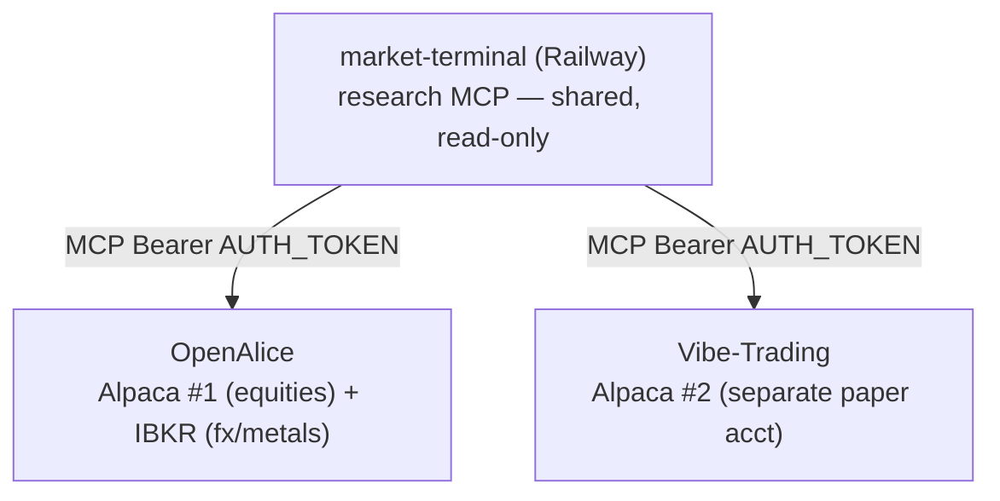

# Vibe-Trading — second autonomous bot (research from market-terminal)

[Vibe-Trading](https://github.com/HKUDS/Vibe-Trading) (HKUDS) is a separate,
full-stack AI trading agent — multi-agent swarms, cross-market **backtesting**,
a 452-factor **Alpha Zoo**, and connector-based broker execution. We run it as a
**second autonomous bot** alongside OpenAlice. Like OpenAlice, it is **execution
+ quant** and lives entirely on its own host; **market-terminal stays research-
only** and is just a **shared MCP research feed** both bots pull from.

> Same hard boundary as `docs/openalice.md`: no broker/trade keys, no order
> logic, and no position state ever enter this repo or its Railway deploy.
> Vibe-Trading holds its own broker + LLM keys on its own deploy.

---

## Role & lane (decided)

**Option A — second autonomous bot**, on a **separate Alpaca paper account** from
OpenAlice. Both bots consume the same market-terminal research over MCP (read-only
— sharing it is fine); they **never share a broker account**.



| Bot | Broker account | Mandate |
|-----|----------------|---------|
| **OpenAlice** | Alpaca `alpaca-61b238e3` (equities) + IBKR `ibkr-tws-aa6a879b` (fx/metals) | discretionary |
| **Vibe-Trading** | **Alpaca paper #2 — separate login/keys** | its own symbol universe (quant/alpha-factor); see coordination rules |

### Coordination rules (must hold — two bots, one broker brand)

1. **Separate Alpaca paper accounts.** Vibe-Trading uses a **different Alpaca
   login → different API key/secret** than OpenAlice. Two paper accounts never
   share positions or orders, so they can't collide. (Alpaca issues one paper
   account per login; create a second account with a separate email/login for a
   clean split, and use *its* keys here only.)
2. **Distinct mandate.** Give Vibe-Trading its own symbol universe and caps via
   its **mandate** (universe / order size / exposure / leverage / daily cap) so
   the two bots aren't unknowingly doubling the same names.
3. **Keys never cross.** Alpaca #2 keys live only in Vibe-Trading; Alpaca #1 keys
   only in OpenAlice; neither set ever touches market-terminal.
4. **Shared research is read-only.** Both bots calling `decision_brief` etc. is
   expected and safe — research has no side effects.

---

## What Vibe-Trading adds over OpenAlice

| Capability | OpenAlice | Vibe-Trading |
|------------|-----------|--------------|
| Paper execution + approval gate | ✅ | ✅ (mandate-gated, kill switch, audit ledger) |
| market-terminal research via MCP | ✅ | ✅ (MCP client mode) |
| **Backtesting** (equity/futures/forex/crypto + composite) | ❌ | ✅ |
| **Alpha Zoo** (452 quant factors) | ❌ | ✅ |
| **Multi-agent swarms** (committee/quant/risk) | ❌ | ✅ |
| Shadow account / trade-journal diagnostics | ❌ | ✅ |

---

## Cloud deployment (required)

Vibe-Trading is **pure Python + API-based LLMs**, so — unlike OpenAlice's `claude`
runtime — it has **no AVX2 host requirement**. Any Docker host works (Railway,
GCP, a VPS). Run it as **its own project/app**, separate from market-terminal and
OpenAlice.

### 1. Deploy (Docker)

```bash
git clone https://github.com/HKUDS/Vibe-Trading.git
cd Vibe-Trading
docker compose up --build -d
```

- Backend defaults to `127.0.0.1:8899`, non-root container.
- **Persistent named volumes** hold memory, session index, skills, shadow
  accounts, broker connector config, swarm history, uploads — survive
  `docker compose up --build`; wiped only by `docker compose down -v`.
- On Railway/any cloud: map the compose service(s), attach volumes, and **set a
  strong `API_AUTH_KEY`** (sensitive endpoints 403 from non-loopback clients
  without it). Put HTTPS in front (Railway domain / reverse proxy).

### 2. Environment / secrets (Vibe-Trading host only)

| Var | Purpose |
|-----|---------|
| `API_AUTH_KEY` | Bearer for the Web UI/API when reachable off-host (cloud) — **required** |
| LLM key (e.g. `DEEPSEEK_API_KEY` / `ANTHROPIC_API_KEY` / …) | the agent brain (its own, separate from OpenAlice) |
| Alpaca **paper #2** key + secret | the separate broker account (set via the connector, below) |

Keep `VIBE_TRADING_ENABLE_SHELL_TOOLS` **unset** (default) on a remote deploy.

### 3. Wire market-terminal as the research feed (MCP client mode)

Create `~/.vibe-trading/agent.json` (mount it on a persistent volume so it
survives rebuilds):

```json
{
  "mcpServers": {
    "market-terminal": {
      "type": "streamableHttp",
      "url": "https://market-terminal-production-131c.up.railway.app/mcp/",
      "headers": { "Authorization": "Bearer <MARKET_TERMINAL_AUTH_TOKEN>" },
      "enabledTools": ["*"]
    }
  }
}
```

Its tools then appear in the agent registry (`decision_brief`, `analysis_regime`,
`forex_brain_*`, etc.). For **swarm workers** to use them, also allowlist via
`VIBE_TRADING_SWARM_AGENT_CONFIG` / `~/.vibe-trading/swarm-agent.json` and
reference the wrapped tool name in the preset.

> Use the **same `AUTH_TOKEN`** market-terminal expects (Railway var). If you
> rotate it (handoff item), update it here **and** in OpenAlice.

### 4. Connect the separate Alpaca paper account

```bash
vibe-trading connector list
vibe-trading connector use alpaca-paper            # the Alpaca paper profile
vibe-trading connector configure alpaca-paper --yes   # paste Alpaca #2 key+secret
vibe-trading connector check
vibe-trading connector account                     # confirm it's the NEW account, not OpenAlice's
```

Then commit a **mandate** (symbol universe / size / exposure / daily cap) before
any `trading_place_order`; the fail-closed pre-trade gate + filesystem kill
switch + audit ledger apply.

---

## Smoke tests

```bash
# research feed reachable from Vibe-Trading
vibe-trading run "use market-terminal to call analysis_regime and decision_brief for BTC-USD; summarize. No orders."

# the SEPARATE Alpaca account (must NOT be alpaca-61b238e3)
vibe-trading connector account
```

| Check | Pass |
|-------|------|
| `agent.json` loads market-terminal tools | `decision_brief` callable from Vibe-Trading |
| `connector account` | shows the **second** Alpaca paper account, not OpenAlice's |
| Mandate set | `trading_place_order` refuses outside the committed universe/caps |
| Cloud auth | UI/API requires `API_AUTH_KEY` from off-host |

---

## Boundary recap

- **market-terminal**: research-only MCP, shared read-only by both bots. No keys, no orders.
- **OpenAlice**: Alpaca #1 + IBKR. Its own keys, cron monitor, inbox approval.
- **Vibe-Trading**: Alpaca #2 (separate), its own LLM + mandate + kill switch.
- The two execution bots never share a broker account; research is the only thing they share.

See also: `docs/openalice.md`, `docs/openalice-cloud-deploy.md` (the OpenAlice
Railway recipe — analogous host setup), `README.md` (MCP feed + `AUTH_TOKEN`).
